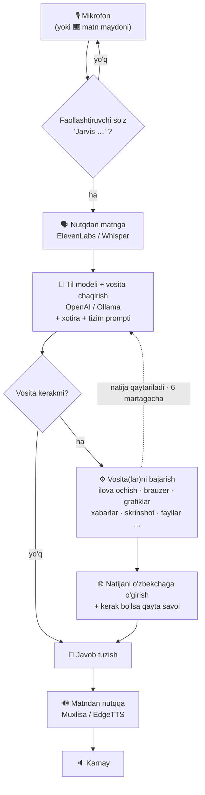

<div align="center">

# 🤖 J.A.R.V.I.S — MARK XL

### *Just A Rather Very Intelligent System*

**Windows uchun real vaqtda, qo‘lsiz ishlaydigan, kompyuteringizni chinakam boshqaradigan ovozli sun’iy intellekt yordamchisi.**
Tabiiy gapiring — u sizni tushunadi, kerakli vositani tanlaydi, vazifani haqiqiy ish stolingizda bajaradi va ovoz bilan javob beradi.


</div>

---

## ✨ Umumiy ma’lumot

JARVIS — bu kelajak uslubidagi HUD interfeysiga ega **faollashtiruvchi so‘zli ovozli yordamchi**. Siz **“Jarvis …”** deysiz, u esa:

- 🎙️ **Tinglaydi** (bulutli yoki oflayn nutqni matnga aylantirish)
- 🧠 **O‘ylaydi** — vositalarni chaqira oladigan til modeli bilan (OpenAI yoki lokal model)
- ⚙️ **Bajaradi** — haqiqiy kompyuteringizda: ilovalarni ochadi, brauzerni boshqaradi, trading grafiklarini chizadi, xabar yuboradi va o‘qiydi, skrinshot oladi…
- 🔊 **Ovoz bilan javob beradi** — tabiiy nutqda
- ❓ **Qayta savol beradi** — kerak bo‘lganda (“Telegram ochildi — kimga yozay?”)

U **API kalitlari bilan onlayn** (tavsiya etiladi) **yoki lokal modellar bilan to‘liq oflayn** ishlaydi — birinchi ishga tushirishda o‘zingiz tanlaysiz.

> 🔐 **API kalitlaringiz hech qachon yuklanmaydi.** Bu repozitoriy faqat kodni o‘z ichiga oladi; kalitlarni bir marta, mahalliy ravishda, sozlash oynasi orqali kiritasiz.

---

## 🧠 Vazifa tizimi qanday ishlaydi

Har bir aytilgan buyruq bitta **navbat tsikli** (turn loop) orqali o‘tadi:



### Bosqichma-bosqich — “*Jarvis, Telegram’ni och va Ali’ga ‘salom’ deb yoz*”

| # | Bosqich | Nima yuz beradi |
|---|---------|-----------------|
| 1 | **Faollashtiruvchi so‘z** | Mikrofon **“Jarvis …”** eshitilmaguncha hammasini e’tiborsiz qoldiradi (shuning uchun atrofdagi gap-so‘z uni ishga tushirmaydi). |
| 2 | **Transkripsiya** | Nutq → matn, tanlangan STT dvigateli orqali. |
| 3 | **Qaror** | Til modeli buyruq + suhbat tarixi + xotirani o‘qib, vositalarni tanlaydi: `open_app(Telegram)` → `send_message(Ali, "salom")`. |
| 4 | **Bajarish** | Har bir vosita ish stolida ishlaydi va natija qaytaradi. Allaqachon ochiq ilovalar **qayta ochilmaydi**, mavjudi ishlatiladi. |
| 5 | **O‘girish va qayta savol** | Natija qisqa tabiiy javobga aylanadi; biror narsa yetishmasa, bitta savol beradi (“kimga yozay?”) va **15 soniyalik javob oynasi** ochiladi — javobni *faollashtiruvchi so‘zsiz* aytasiz. |
| 6 | **Gapirish** | Javob TTS dvigateliga gap-gap uzatiladi, shuning uchun o‘ylab bo‘lishidan oldinroq gapira boshlaydi. |

### Vosita tizimi

Til modeliga **vositalar** (funksiyalar) katalogi beriladi. Har bir buyruq uchun u:

1. Kerakli vosita(lar)ni tanlaydi va parametrlarini to‘ldiradi,
2. Ularni `JarvisLocal._execute_tool()` orqali ishga tushiradi,
3. Natijani keyingi qadam uchun qaytaradi — **ko‘p bosqichli vazifalar bitta navbatda 6 martagacha vosita aylanasini** bog‘laydi.

Ba’zi natijalar (qidiruv, ekran tahlili, grafik chizish) ikkinchi LLM bosqichida umumlashtiriladi; oddiy tasdiqlar esa darhol aytiladi.

### Ovozli boshqaruv

| Boshqaruv | Qanday |
|-----------|--------|
| 🗣️ **Faollashtiruvchi so‘z** | Har qanday buyruqni **“Jarvis …”** bilan boshlang |
| 🎤 **Bosib-gapirish** | **“BOSIB TURIB GAPIR”** tugmasini bosib turib gapiring, qo‘yvoring — faollashtiruvchi so‘z shart emas |
| ⏹️ **To‘xtatish** | **“Jarvis Stop”** deng (yoki **Esc** bosing) — gapirishni darhol to‘xtatib, tinglaydi |
| 🔇 **Mute / To‘liq ekran** | **F4** / **F11** |

---

## 📋 U nimalarni qila oladi

| Toifa | Shunday deysiz… | Natija |
|-------|-----------------|--------|
| 🚀 **Ilova ochish** | “Chrome’ni och”, “Spotify’ni ishga tushir” | Istalgan ilova yoki saytni ochadi |
| 🌐 **Brauzer** | “… ni qidir”, “Instagram’ni och” | Mavjud Chrome’ingizda **yangi tab** (yangi oyna emas) |
| 📈 **Trading tahlili (TradingView)** | “oltinni 15 daqiqada och va trend hamda support-resistance bilan tahlil qil” | Grafikni ochib **strategiya bo‘yicha avtomatik tahlil** qiladi: trend chiziq tuzilmasi (A–F swing nuqtalari + yo‘nalish o‘qi) va Magic-Line support/resistance zonalari — barchasi haqiqiy narx nuqtalaridan (TradingView grafik API orqali). Har tahlil **yangi tabda**; “grafikni tozala” chizmalarni o‘chiradi |
| 💬 **Xabar yuborish** | “Ali’ga Telegram’da salom deb yoz” | Xabar yuboradi — ochiq ilovani ishlatadi, qayta ochmaydi |
| 📥 **Xabarni o‘qish** | “Ali nima dedi?” | Kelgan oxirgi xabarlarni ovoz bilan o‘qib beradi |
| 📸 **Skrinshot** | “skrinshot ol”, “Chrome ekranini ol”, “2-monitorni ol” | To‘liq ekran, **ko‘p monitorni biladi**, Pictures’ga saqlaydi |
| ⏰ **Eslatma va budilnik** | “soat 7 ga eslat”, “budilnik qo‘y” | Vaqtli eslatma / budilnik — vaqti kelganda JARVIS **ovoz chiqarib** eslatadi |
| 📝 **Eslatma va ro‘yxat** | “eslatma yoz…”, “xarid ro‘yxatiga sut qo‘sh” | Tez eslatmalar va nomli ro‘yxatlar |
| 🌦️ **Ma’lumot** | “Toshkentda ob-havo”, “soat nechi”, “… qidir” | Ob-havo, vaqt/sana, veb-qidiruv |
| 💱 **O‘zbek jonli ma’lumot** | “dollar kursi qancha”, “bitcoin narxi”, “namoz vaqti”, “bugungi yangiliklar” | Markaziy bank valyuta kursi, kripto narxlari, namoz vaqtlari, O‘zbek yangiliklari |
| 🌅 **Ertalabki brifing** | “ertalabki brifing”, “har kuni 8 da brifing ber” | Sana, ob-havo, valyuta va bugungi eslatmalarni bitta ovozli xulosa; kunlik avtomatik ham |
| 🌐 **Tarjima** | “buni inglizchaga o‘gir”, “ruscha qil” | Matnni istalgan tilga tarjima qiladi |
| ▶️ **YouTube** | “lo-fi musiqa qo‘y”, “trenddagi videolar” | YouTube videolarini qo‘yadi / ko‘rsatadi |
| 🖥️ **Tizim boshqaruvi** | “ovozni 50 qil”, “ekranni qulfla”, “wifi o‘chir”, “pauza” | Ovoz, yorqinlik, wifi, quvvat, media tugmalari |
| 🖱️ **Avtomatlashtirish** | “yoz…”, “shu yerga bos”, “pastga aylantir” | Sichqoncha / klaviatura / oyna boshqaruvi |
| 📂 **Fayllar** | “ish stolimni ko‘rsat”, “report.pdf ni top” | Fayl va papka boshqaruvi |
| 📄 **Fayl AI** | *PDF/CSV/rasm tashlang →* “buni umumlashtir” | Rasm, PDF, CSV, audio, videoni qayta ishlaydi |
| 💻 **Dasturlash** | “python skript yoz …” | Kod yozadi, tahrirlaydi, ishga tushiradi; loyihalar quradi |
| 🧩 **Ko‘p bosqichli** | “… ni o‘rgan va faylga saqla” | Mustaqil ko‘p bosqichli vazifani rejalashtiradi |
| 👁️ **Ko‘rish (Vision)** | “ekranimda nima bor?” | Ekranni vision model bilan tahlil qiladi |
| 🎮 **O‘yinlar** | “Steam o‘yinlarimni yangila” | Steam / Epic o‘rnatish va yangilash |
| 🧠 **Xotira** | “mening ismim Ali”, “Toshkentda yashayman” | Shaxsiy faktlarni eslab qoladi; uzun suhbatlarni fonda umumlashtiradi |
| 📜 **Faoliyat tarixi** | **📜 TARIX** tugmasi (HUD) | Bajarilgan barcha amallar tarixi — jonli qidiruv bilan |

> **📈 TradingView tahlili — bir martalik sozlash:** `tv_chrome.bat` ni ishga tushiring, ochilgan toza Chrome’da TradingView’ga **bir marta login qiling** va o‘sha oynani ochiq qoldiring. JARVIS shu oynaga CDP orqali ulanib grafikni boshqaradi (chizish TradingView’ning o‘z grafik API’si bilan — aniq narx nuqtalarida). Har tahlil yangi tabda ochiladi.

---

## 🚀 Boshlash

> **Talablar:** Windows 10/11 · [Python 3.12](https://www.python.org/downloads/) (*“Add Python to PATH”* ni belgilang) · internet · mikrofon

```bash
git clone https://github.com/sensat1onall/Jarvis.git
cd Jarvis
run.bat
```

**Birinchi ishga tushirishda** u avtomatik ravishda:
1. Alohida `.venv` muhitini yaratadi va barcha kutubxonalarni o‘rnatadi (bir necha daqiqa),
2. **Initialisation** oynasini ochadi — **STT**, **LLM** va **TTS** dvigatellarini tanlab, API kalitlaringizni kiritasiz,
3. Onlayn bo‘ladi. Gapira boshlang. 🎙️

Sozlashdan keyin istalgan vaqtda **⚙ SOZLAMALAR** tugmasi orqali hammasini o‘zgartirasiz — qayta ishga tushirish shart emas (kalitlaringiz birlashtiriladi, hech qachon o‘chmaydi).

### 📦 Tayyor `.exe` (Python shart emas)

Python o‘rnatishni xohlamasangiz — bitta papkadan ishga tushiradigan mustaqil `.exe` quring:

```bash
build_exe.bat
```

Bu `dist\JARVIS\JARVIS.exe` ni yaratadi (bulutli sozlama uchun; og‘ir lokal modellar kiritilmaydi, shuning uchun GPU ham, Python ham kerak emas). Butun `dist\JARVIS` papkasini zip qilib ulashishingiz mumkin — qabul qiluvchi `JARVIS.exe` ni ikki marta bosadi, tamom. Kalitlaringiz `dist\JARVIS\config\` ichida boradi, shuning uchun faqat **ishongan** odamlarga bering.

---

## 🔌 Dvigatellar (sozlash oynasida tanlanadi)

| Qatlam | Bulut (API kalit) | Oflayn (lokal) |
|--------|-------------------|----------------|
| 🗣️ **Nutqdan matnga** | ElevenLabs Scribe | faster-whisper · Vosk |
| 🧠 **Til modeli (LLM)** | OpenAI (gpt-5.1, gpt-4o…) | Ollama (qwen2.5, llama3.2…) |
| 🔊 **Matndan nutqqa** | ElevenLabs · Muxlisa (o‘zbek) | EdgeTTS (bepul) · Kokoro |

**To‘liq bulutli** sozlama (ElevenLabs → OpenAI → Muxlisa) eng tezi va GPU talab qilmaydi. Bulut so‘rovlari vaqtinchalik tarmoq uzilishlarida o‘zi qayta uradi.

---

## 📁 Loyiha tuzilmasi

```
main.py            # navbat tsikli, vosita e'lonlari va yo'naltirish, TTS, mic loop
ui.py              # PyQt6 HUD (HUD, tizim monitori, log, fayl tashlash, sozlash oynasi)
run.bat            # ishga tushiruvchi — birinchi marta venv'ni o'zi yaratadi

core/
  llm_client.py    # provayderga moslashgan LLM (OpenAI / Ollama) — stream, vosita, vision
  stt.py           # nutqdan matnga dvigatellari
  tts.py           # matndan nutqqa dvigatellari
  prompt.txt       # yordamchining tizim prompti
  installer.py     # konfiguratsiyaga kerak bo'lgan kutubxonalarnigina o'rnatadi

actions/           # har bir imkoniyat uchun bitta modul (open_app, browser_control,
                   # tradingview, send_message, screenshot, notes, reminder, …)
agent/             # mustaqil ko'p bosqichli vazifa tizimi (planner -> executor -> recovery)
memory/            # uzoq muddatli shaxsiy faktlar + konfiguratsiya boshqaruvi
```

> **Yangi vosita qo‘shish** = uni `main.py` dagi `TOOL_DECLARATIONS` ga + `_execute_tool()` ga shox qo‘shing, mantiqni esa `actions/` ga joylang.

---

## 🔐 Maxfiylik va kalitlar

- **API kalitlar faqat `config/api_keys.json` da saqlanadi — u git tomonidan e’tiborsiz qoldiriladi** va hech qachon yuklanmaydi.
- Uzoq muddatli xotira (`memory/long_term.json`) ham faqat kompyuteringizda qoladi.
- Lokal dvigatellar bilan (Whisper + Ollama + EdgeTTS/Kokoro) u **100% oflayn** ishlay oladi.

---

## ⌨️ Tugmalar

| Tugma | Amal |
|-------|------|
| **F4** | Mikrofonni o‘chirish / yoqish |
| **F11** | To‘liq ekran |
| **Esc** | Gapirishni to‘xtatish / bo‘lish |

---

<div align="center">

Ochiq manbali **MARK XL** ovozli-yordamchi asosida qurilgan · Python + PyQt6 quvvatida.

</div>
