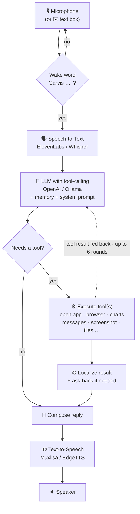

<div align="center">

# 🤖 J.A.R.V.I.S — MARK XL

### *Just A Rather Very Intelligent System*

**A real-time, hands-free voice assistant for Windows that actually controls your computer.**
Speak naturally — it understands you, picks the right tool, does the task on your real desktop, and replies out loud.


</div>

---

## ✨ Overview

JARVIS is a **wake-word voice assistant** with a sci-fi HUD. You say **“Jarvis …”**, and it:

- 🎙️ **Listens** (cloud or offline speech-to-text)
- 🧠 **Thinks** with an LLM that can **call tools** (OpenAI, or a local model)
- ⚙️ **Acts** on your real machine — opens apps, drives your browser, draws trading charts, sends & reads messages, takes screenshots…
- 🔊 **Replies out loud** in natural speech
- ❓ **Asks back** when it needs more (“opened Telegram — who do you want to text?”)

It runs **online with API keys** (recommended) **or fully offline** with local models — your choice on the first-run setup screen.

> 🔐 **Your API keys are never committed.** This repo ships the code only; you add your own keys once, locally, through the setup screen.

---

## 🧠 How the task system works

Every spoken request flows through one **turn loop**:



### Step by step — “*Jarvis, open Telegram and text Ali ‘hi’*”

| # | Stage | What happens |
|---|-------|--------------|
| 1 | **Wake word** | The mic ignores everything until it hears **“Jarvis …”** (so background talk never triggers it). |
| 2 | **Transcribe** | Speech → text via the configured STT engine. |
| 3 | **Decide** | The LLM reads the request + conversation history + memory, and chooses tools: `open_app(Telegram)` → `send_message(Ali, "hi")`. |
| 4 | **Execute** | Each tool runs on the desktop and returns a result string. Already-open apps are **re-used, not reopened**. |
| 5 | **Localize & ask back** | The result becomes a short natural reply; if something is missing it asks one follow-up (“who should I text?”) and opens a **15-second answer window** so you reply *without* the wake word. |
| 6 | **Speak** | The reply is streamed to TTS sentence-by-sentence, so it starts talking before it has finished thinking. |

### The tool system

The LLM is given a catalogue of **tools** (functions). For each request it:

1. Picks the right tool(s) and fills their parameters,
2. Runs them via `JarvisLocal._execute_tool()`,
3. Feeds the result back for the next step — **multi-step tasks chain up to 6 tool rounds** in one turn.

Some results (search, screen analysis, charting) get a second LLM pass to summarize; simple confirmations are spoken instantly.

### Voice controls

| Control | How |
|---------|-----|
| 🗣️ **Wake word** | Start any command with **“Jarvis …”** |
| 🎤 **Push-to-talk** | Hold the **“BOSIB TURIB GAPIR”** button, talk, release — no wake word needed |
| ⏹️ **Barge-in / stop** | Say **“Jarvis Stop”** (or press **Esc**) to instantly stop talking and listen |
| 🔇 **Mute / Fullscreen** | **F4** / **F11** |

---

## 📋 What it can do

| Category | Say something like… | Result |
|----------|---------------------|--------|
| 🚀 **Open apps** | “open Chrome”, “launch Spotify” | Opens any app or website |
| 🌐 **Browser** | “search X”, “open Instagram” | New tab in your **existing** Chrome (no new window) |
| 📈 **Trading (TradingView)** | “open the gold chart”, “switch to 15m”, “add RSI”, “draw a trend line” | Opens charts (XAUUSD…), sets timeframe, adds indicators, draws trend / fib / support-resistance |
| 💬 **Send messages** | “text Ali on Telegram saying hi” | Sends a message — focuses the open app, no reopen |
| 📥 **Read messages** | “what did Ali say?” | Reads the latest incoming messages out loud |
| 📸 **Screenshots** | “take a screenshot”, “capture the Chrome screen”, “screenshot monitor 2” | Full-screen capture, **multi-monitor aware**, saved to Pictures |
| ⏰ **Reminders & alarms** | “remind me at 7”, “set an alarm” | Schedules a timed reminder / alarm |
| 📝 **Notes & lists** | “note that…”, “add milk to my shopping list” | Quick notes & named lists |
| 🌦️ **Info** | “weather in Tashkent”, “what time is it”, “search …” | Weather, time/date, web search |
| ▶️ **YouTube** | “play lo-fi music”, “trending videos” | Plays / lists YouTube videos |
| 🖥️ **System control** | “volume 50”, “lock screen”, “wifi off”, “pause” | Volume, brightness, wifi, power, media keys |
| 🖱️ **Automation** | “type …”, “click here”, “scroll down” | Mouse / keyboard / window control |
| 📂 **Files** | “list my desktop”, “find report.pdf” | File & folder management |
| 📄 **File AI** | *drop a PDF/CSV/image →* “summarize this” | Processes images, PDFs, CSV, audio, video |
| 💻 **Coding** | “write a python script that …” | Writes, edits, runs code; builds projects |
| 🧩 **Multi-step** | “research X and save it to a file” | Autonomous multi-step task planning |
| 👁️ **Vision** | “what’s on my screen?” | Analyzes the screen with a vision model |
| 🎮 **Games** | “update my Steam games” | Steam / Epic install & update |
| 🧠 **Memory** | “my name is Ali”, “I live in Tashkent” | Remembers personal facts across sessions |

---

## 🚀 Getting started

> **Requirements:** Windows 10/11 · [Python 3.12](https://www.python.org/downloads/) (tick *“Add Python to PATH”*) · internet · a microphone

```bash
git clone https://github.com/sensat1onall/Jarvis.git
cd Jarvis
run.bat
```

On the **first run** it automatically:
1. Creates an isolated `.venv` and installs all dependencies (a few minutes),
2. Opens the **Initialisation** overlay — pick your **STT**, **LLM** and **TTS** engines and paste your API keys,
3. Comes online. Start talking. 🎙️

After setup, change anything anytime with the **⚙ CONFIGURE** button — no restart needed (your keys are merged in, never wiped).

---

## 🔌 Engines (pick on the setup screen)

| Layer | Cloud (API key) | Offline (local) |
|-------|-----------------|-----------------|
| 🗣️ **Speech-to-Text** | ElevenLabs Scribe | faster-whisper · Vosk |
| 🧠 **LLM** | OpenAI (gpt-4o-mini…) | Ollama (qwen2.5, llama3.2…) |
| 🔊 **Text-to-Speech** | ElevenLabs · Muxlisa (Uzbek) | EdgeTTS (free) · Kokoro |

The **all-cloud** setup (ElevenLabs → OpenAI → Muxlisa) is the fastest and needs no GPU. Cloud calls auto-retry on transient network hiccups.

---

## 📁 Project structure

```
main.py            # the turn loop, tool declarations & routing, TTS worker, mic loops
ui.py              # PyQt6 HUD (HUD canvas, system monitor, log, file drop, setup overlay)
run.bat            # launcher — creates the venv on first run

core/
  llm_client.py    # provider-aware LLM (OpenAI / Ollama) — stream, tools, vision
  stt.py           # speech-to-text engines
  tts.py           # text-to-speech engines
  prompt.txt       # the assistant's system prompt
  installer.py     # auto-installs only the packages your config needs

actions/           # one module per capability (open_app, browser_control,
                   # tradingview, send_message, screenshot, notes, reminder, …)
agent/             # autonomous multi-step task system (planner -> executor -> recovery)
memory/            # long-term personal facts + config management
```

> **Adding a tool** = add it to `TOOL_DECLARATIONS` + a branch in `_execute_tool()` in `main.py`, with the logic in `actions/`.

---

## 🔐 Privacy & keys

- **API keys are stored only in `config/api_keys.json`, which is git-ignored** and never pushed.
- Long-term memory (`memory/long_term.json`) stays on your machine too.
- With local engines (Whisper + Ollama + EdgeTTS/Kokoro), it can run **100% offline**.

---

## ⌨️ Shortcuts

| Key | Action |
|-----|--------|
| **F4** | Mute / unmute the microphone |
| **F11** | Toggle fullscreen |
| **Esc** | Stop speaking / interrupt |

---

<div align="center">

Built on the open-source **MARK XL** voice-assistant base · powered by Python + PyQt6.

</div>
